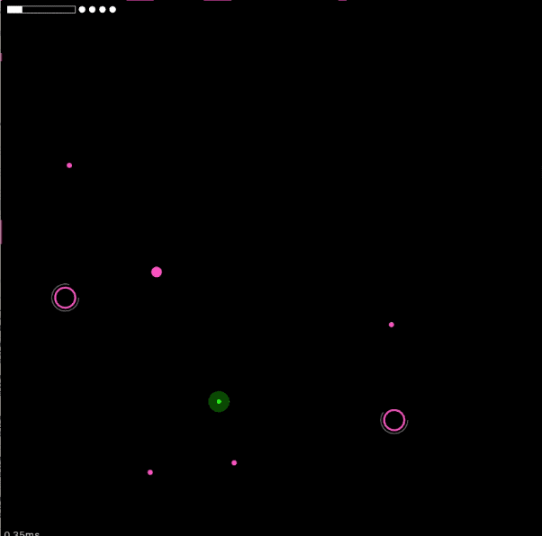

# [Gravitron](http://gravitron.surge.sh/)

this is a little game I'm cooking up, written in [Reason](https://reasonml.github.io), using [Reprocessing](https://github.com/Schmavery/reprocessing) (a cross-platform opengl-backed 2d-graphics library).

Try it out at http://gravitron.surge.sh/, and tell me what you think!

Download the osx native version from the [releases](https://github.com/jaredly/gravitron/releases) page.



## Building

```
git submodule update --init --recursive
yarn
```

### Web

(assuming you have `http-server` installed, via `yarn global add http-server`)
```
npm run js && npm run js:serve
```

Then open your browser to `http://localhost:3121`

If you don't have http-server, you can run `npm run js` and start your favorite webserver in the `docs` directory.

### Native macOS

(development)
```
npm run build
npm start
```

(release, make a mac app)
```
npm run build:native
cd bundler && ./bundle.sh
```

Now you've got a mac app in `./bundler/Gravitron.app`.

### Android

NOTE: You must have opam setup for this to work.
ALSO NOTE: Ocaml currently produces binaries that have "text relocations", which android is unhappy about. So you'll get a popup in the dev build, but it doesn't show in the release build.

```
./reasongl-android/setup_opam.sh # this is idempotent
npm run build:android
```

If you also want to install the debug apk to a simulator or device, do `npm run run:android`.

### iOS

NOTE: You must have opam setup for this to work.

```
./reasongl-ios/setup_opam.sh # this is idempotent
npm run build:ios
```

Then open the project `./ios/OcamlIOS.xcodeproj` in Xcode, and you should be able to build & run.

## Contributing

### Android
Some good resources
- https://docs.oracle.com/javase/7/docs/technotes/guides/jni/spec/types.html
- https://caml.inria.fr/pub/docs/manual-ocaml/intfc.html

## License

This code is licensed under [Creative Commons Attribution-NonCommercial 4.0](https://creativecommons.org/licenses/by-nc/4.0/legalcode) (CC BY-NC 4.0). If you use this code, you must attribute me (Jared Forsyth), and link back to this repository.
If you want me to license parts of the codebase under a more permissive license, such as one that allows commercial use, you're welcome to ask.